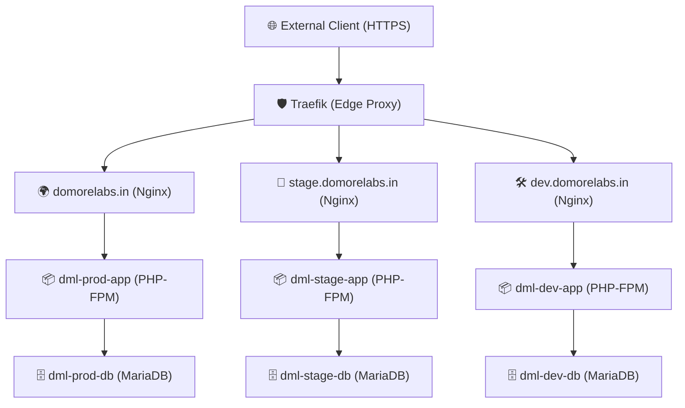

# Infrastructure Overview: DoMoreLabs.in (Moodle SCORM Platform)

This document provides a detailed overview of the core infrastructure services running for the `domorelabs.in` project on the `opssim-prod-vnic` server.

## 🏗 System Architecture

The project follows a "Triple-Stack" architecture (Dev, Stage, Prod) managed via Docker Compose. Each stack uses a high-performance Nginx + PHP-FPM + MariaDB configuration, secured by Traefik.

## 📦 Environments

### 🛠 1. Development (`dev.domorelabs.in`)
- **Location**: `/srv/dev.domorelabs.in`
- **Subnet**: `172.40.2.0/24`
- **IPs**: App `.10`, DB `.20`, Nginx `.30`

### 🧪 2. Staging (`stage.domorelabs.in`)
- **Location**: `/srv/stage.domorelabs.in`
- **Subnet**: `172.40.1.0/24`
- **IPs**: App `.10`, DB `.20`, Nginx `.30`

### 🌍 3. Production (`domorelabs.in`)
- **Location**: `/srv/domorelabs.in`
- **Subnet**: `172.40.0.0/24`
- **IPs**: App `.10`, DB `.20`, Nginx `.30`

## ⚙️ Operational Details

### 📂 Directory Structure
| Service | Data Directory | Role |
| :--- | :--- | :--- |
| **App Code** | `/var/www/html` | Moodle Source Code |
| **Data** | `/var/www/moodledata` | Moodle Files & Cache |
| **DB Data** | `./mariadb_data` | Persistent Database Storage |

### 🛠 Technology Stack
- **Web Server**: Nginx (Stable-Alpine)
- **Application**: Moodle 4.4+ (PHP 8.3-FPM)
- **Database**: MariaDB 11.4
- **Proxy**: Traefik v3 (SSL via Let's Encrypt)

---
*Last updated: April 27, 2026*

## 🌍 IP Address Reservations (Project Specific)

| Domain | Environment | Subnet | IP Allocation |
| :--- | :--- | :--- | :--- |
| **domorelabs.in** | Prod | 172.40.0.0/24 | .10 (App), .20 (DB), .30 (Nginx) |
| **domorelabs.in** | Stage | 172.40.1.0/24 | .10 (App), .20 (DB), .30 (Nginx) |
| **domorelabs.in** | Dev | 172.40.2.0/24 | .10 (App), .20 (DB), .30 (Nginx) |
