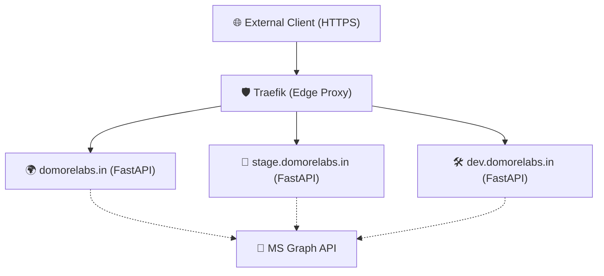

# Infrastructure Overview: DoMoreLabs.in

This document provides a detailed overview of the core infrastructure services running for the `domorelabs.in` project on the `opssim-prod-vnic` server.

## 🏗 System Architecture

The project follows a "Triple-Stack" architecture (Dev, Stage, Prod) managed via Docker Compose, utilizing Traefik as the reverse proxy for SSL termination and routing.

## 📦 Environments

### 🛠 1. Development (`dev.domorelabs.in`)
- **Location**: `/srv/dev.domorelabs.in`
- **Branch**: `dev`
- **Subnet**: `172.40.2.0/24`
- **Internal IP**: `172.40.2.10`
- **Role**: Active development and testing of new features.

### 🧪 2. Staging (`stage.domorelabs.in`)
- **Location**: `/srv/stage.domorelabs.in`
- **Branch**: `stage`
- **Subnet**: `172.40.1.0/24`
- **Internal IP**: `172.40.1.10`
- **Role**: Pre-production validation and client review.

### 🌍 3. Production (`domorelabs.in`)
- **Location**: `/srv/domorelabs.in`
- **Branch**: `master`
- **Subnet**: `172.40.0.0/24`
- **Internal IP**: `172.40.0.10`
- **Hostnames**: `domorelabs.in`, `www.domorelabs.in`
- **Role**: Live production environment.

## ⚙️ Operational Details

### 📂 Directory Structure
| Service | Data Directory | Git Branch |
| :--- | :--- | :--- |
| **Production** | `/srv/domorelabs.in` | `master` |
| **Staging** | `/srv/stage.domorelabs.in` | `stage` |
| **Development** | `/srv/dev.domorelabs.in` | `dev` |

### 🛠 Technology Stack
- **Backend**: Python 3.13 (FastAPI)
- **Frontend**: Vanilla HTML/CSS/JS (Tailwind via CDN)
- **Proxy**: Traefik v3 (SSL via Let's Encrypt)
- **Email**: Microsoft Graph API

---
*Last updated: April 27, 2026*

## 🌍 IP Address Reservations (Project Specific)

| Domain | Environment | Subnet | IP Reservation |
| :--- | :--- | :--- | :--- |
| **domorelabs.in** | Prod | 172.40.0.0/24 | 172.40.0.10 |
| **domorelabs.in** | Stage | 172.40.1.0/24 | 172.40.1.10 |
| **domorelabs.in** | Dev | 172.40.2.0/24 | 172.40.2.10 |
