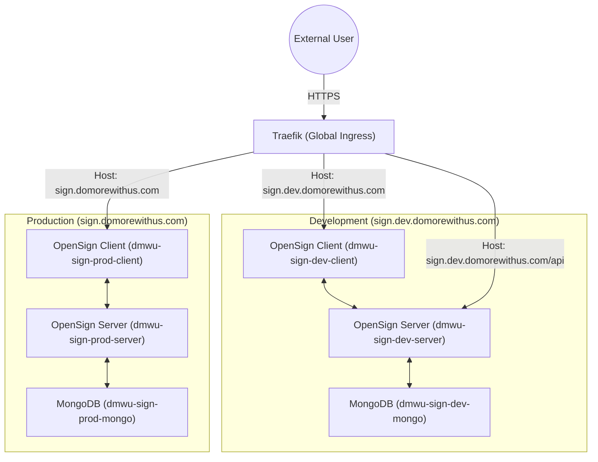

# OpenSign Infrastructure Deployment Plan

This document outlines the architecture and deployment strategy for the OpenSign platform and the DoMoreTech Portal on the `domorewithus.com` domain, following the **Triple-Stack Subdomain Strategy**.

## 🚦 Current Project Status

| Milestone | Status | Details |
| :--- | :--- | :--- |
| **OpenSign (Dev)** | ✅ **LIVE** | Serving at `sign.dev.domorewithus.com` |
| **DoMoreTech Portal (Dev)** | ✅ **LIVE** | Premium landing page at `dev.domorewithus.com` |
| **GitHub Integration** | ✅ **DONE** | Repository `dhisomu/domorewithus.com` initialized. |
| **DNS Setup** | ✅ **DONE** | Global IP reservations and DNS registry finalized. |
| **Staging Promotion** | ⏳ PENDING | Mirroring code to `stage` branch/environment. |
| **Production Promotion** | ⏳ PENDING | Final rollout to `master` branch and root domain. |

## 🗺️ System Architecture

OpenSign is deployed as a modular stack integrated with the global Traefik ingress proxy. Each environment is fully isolated via dedicated Docker networking.

---

## 🌍 Network IP Address Reservations

To prevent collisions with existing `xelify.in` services, a dedicated private IP series has been reserved for the DoMoreWithUs infrastructure.

| Environment | subdomain | IP Subnet | Docker Network Name |
| :--- | :--- | :--- | :--- |
| **Development** | `sign.dev.domorewithus.com` | `172.30.30.0/24` | `dmwu-sign-dev-net` |
| **Staging** | `sign.stage.domorewithus.com` | `172.30.20.0/24` | `dmwu-sign-stage-net` |
| **Production** | `sign.domorewithus.com` | `172.30.10.0/24` | `dmwu-sign-prod-net` |

---

## 📦 Core Service Components

Each environment consists of three primary services managed via `docker-compose.yml`.

| Service | Image | Responsibility |
| :--- | :--- | :--- |
| **sign-client** | `opensign/opensign:main` | React-based frontend providing the UI for document signing and management. |
| **sign-server** | `opensign/opensignserver:main` | Node.js/Express backend handling API requests, signing logic, and file storage. |
| **sign-db** | `mongo:latest` | Primary database for storing user accounts, document metadata, and logs. |

---

## 🛠️ Execution & Integration Plan

### Phase 1: Infrastructure & Core Ops (DONE)
1.  **IP Reservations**: Reserved `172.30.0.0/16` for DM-W-U ecosystem.
2.  **OpenSign Dev**: Deployed Node/Mongo stack via `docker-compose`.
3.  **Git Ops**: Created `domorewithus.com` repo and established `dev`/`stage`/`master` branching.

### Phase 2: Web Excellence (IN PROGRESS)
1.  **Dev Portal**: Implemented premium landing page in `/srv/dev.domorewithus.com` (Tracks `dev` branch).
2.  **Branding**: Integrated official logo and "Dr. Somasundaram B & Mr. Balasubramaniam R" founder story.
3.  **Optimization**: Enabled Brotli/Gzip compression in the Nginx-Brotli stack.

### Phase 3: Promotion & Launch (PENDING)
1.  **Staging**: Merge `dev` -> `stage` and deploy to `/srv/stage.domorewithus.com`.
2.  **Production**: Merge `stage` -> `master` and deploy to `/srv/domorewithus.com`.
3.  **Final Polish**: Verify mobile responsiveness and form logic across all stacks.

---

## ⚠️ User Review Required

> [!IMPORTANT]
> **DNS Configuration & Registry**
> A full record of all DNS settings (including Email, Security, and App routing) is now maintained in the **[dns_registry.md](dns_registry.md)**.
>
> Please ensure that `*.domorewithus.com` and `*.dev.domorewithus.com` are pointed to the server IP (`129.159.226.144`). Traefik requires DNS resolution to complete the Let's Encrypt TLS handshake.

> [!WARNING]
> **Storage Strategy**
> Currently, we are using **local disk storage**. If document volume becomes high (thousands of PDFs), we should consider migrating to S3-compatible storage (DigitalOcean/AWS).

---

## ✅ Verification Strategy

| Test Case | Method | Expected Result |
| :--- | :--- | :--- |
| **SSL Validation** | External Browser | `https` lock appears with Let's Encrypt certificate. |
| **API Connectivity** | Browser Console | Calls to `/api/app` return `200 OK` from the server container. |
| **Data Persistence** | Container Restart | Signs up a user, restarts containers, and verifies user still exists. |

---
*Created: April 21, 2026*
