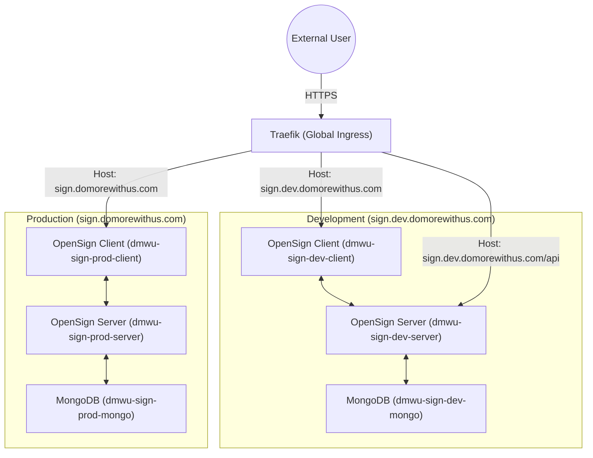

# OpenSign Infrastructure Deployment Plan

This document outlines the architecture and deployment strategy for the OpenSign platform on the `domorewithus.com` domain, following the **Triple-Stack Subdomain Strategy**.

## 🗺️ System Architecture

OpenSign is deployed as a modular stack integrated with the global Traefik ingress proxy. Each environment is fully isolated via dedicated Docker networking.

---

## 🌍 Network IP Address Reservations

To prevent collisions with existing `xelify.in` services, a dedicated private IP series has been reserved for the DoMoreWithUs infrastructure.

| Environment | subdomain | IP Subnet | Docker Network Name |
| :--- | :--- | :--- | :--- |
| **Development** | `sign.dev.domorewithus.com` | `172.30.30.0/24` | `dmwu-sign-dev-net` |
| **Staging** | `sign.stage.domorewithus.com` | `172.30.20.0/24` | `dmwu-sign-stage-net` |
| **Production** | `sign.domorewithus.com` | `172.30.10.0/24` | `dmwu-sign-prod-net` |

---

## 📦 Core Service Components

Each environment consists of three primary services managed via `docker-compose.yml`.

| Service | Image | Responsibility |
| :--- | :--- | :--- |
| **sign-client** | `opensign/opensign:main` | React-based frontend providing the UI for document signing and management. |
| **sign-server** | `opensign/opensignserver:main` | Node.js/Express backend handling API requests, signing logic, and file storage. |
| **sign-db** | `mongo:latest` | Primary database for storing user accounts, document metadata, and logs. |

---

## 🛠️ Execution & Integration Plan

### Phase 1: Environment Baseline (DEV)
1.  **Directory Setup**: Create `/srv/domorewithus.com/dev/sign/` base directory.
2.  **Secrets Management**: Provision `.env` with unique `MASTER_KEY` and local storage flags.
3.  **Network Init**: Define the `172.30.30.0/24` subnet in the compose file.
4.  **Traefik Linking**: Apply standard labels for TLS and PathPrefix routing.

### Phase 2: App Integration
*   Configure the backend to use local file storage (`USE_LOCAL=TRUE`) for document persistence.
*   Mount persistent volumes for MongoDB (`mongo-data`) and OpenSign files (`opensign-files`).

---

## ⚠️ User Review Required

> [!IMPORTANT]
> **DNS Configuration & Registry**
> A full record of all DNS settings (including Email, Security, and App routing) is now maintained in the **[dns_registry.md](dns_registry.md)**.
>
> Please ensure that `*.domorewithus.com` and `*.dev.domorewithus.com` are pointed to the server IP (`129.159.226.144`). Traefik requires DNS resolution to complete the Let's Encrypt TLS handshake.

> [!WARNING]
> **Storage Strategy**
> Currently, we are using **local disk storage**. If document volume becomes high (thousands of PDFs), we should consider migrating to S3-compatible storage (DigitalOcean/AWS).

---

## ✅ Verification Strategy

| Test Case | Method | Expected Result |
| :--- | :--- | :--- |
| **SSL Validation** | External Browser | `https` lock appears with Let's Encrypt certificate. |
| **API Connectivity** | Browser Console | Calls to `/api/app` return `200 OK` from the server container. |
| **Data Persistence** | Container Restart | Signs up a user, restarts containers, and verifies user still exists. |

---
*Created: April 21, 2026*
