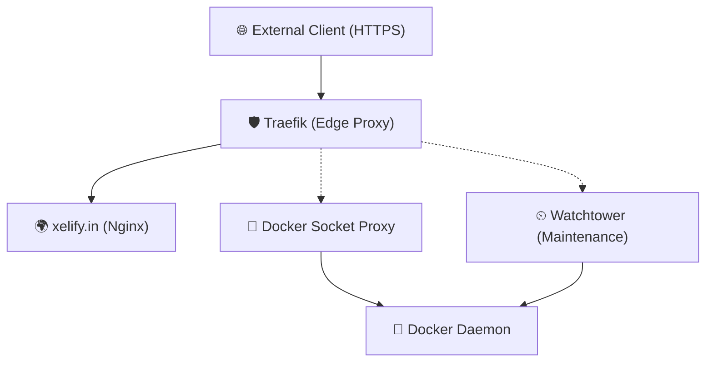

# Infrastructure Overview

This document provides a detailed overview of the core infrastructure services running on the `opssim-prod-vnic` server.

## 🏗 System Architecture

The infrastructure is composed of several containerized services managed via Docker Compose, utilizing Traefik as the reverse proxy, Watchtower for automated updates, and Nginx for content delivery.

## 📦 Core Services

### 🛡 1. Traefik
- **Image**: `traefik:v3`
- **Location**: `/opt/traefik`
- **Role**: Entry point/Reverse Proxy for the entire infrastructure. It handles SSL termination and dynamic configuration.
- **Provider**: Uses `docker-socket-proxy` for secure Docker daemon access.

### 🔌 2. Docker Socket Proxy
- **Image**: `tecnativa/docker-socket-proxy:latest`
- **Location**: `/opt/docker-socket-proxy`
- **Role**: Securely exposes the Docker socket to Traefik and other services, minimizing direct exposure to the host's `/var/run/docker.sock`.
- **Ports**: Listens on `127.0.0.1:2375` (internal host loopback).

### 🌍 3. Xelify (Website)
- **Image**: `fholzer/nginx-brotli:latest`
- **Location**: `/srv/xelify.in`
- **Role**: Serves the primary website content with Brotli compression enabled.
- **Backend Configuration**: Managed via Traefik labels for `Host(\`xelify.in\`)` with TLS enabled via Let's Encrypt.

### ⏲ 4. Watchtower
- **Image**: `containrrr/watchtower`
- **Location**: `/opt/watchtower`
- **Role**: Automates the update process for all containers.
- **Schedule**: Containers are updated at **4:15 AM** daily, with old images being cleaned up automatically.
- **Enabled On**: Specifically monitors containers with the label `com.centurylinklabs.watchtower.enable=true`.

## ⚙️ Operational Details

### 📂 Directory Structure
| Service | Data Directory |
| :--- | :--- |
| **Traefik** | `/opt/traefik` |
| **Docker Proxy** | `/opt/docker-socket-proxy` |
| **Watchtower** | `/opt/watchtower` |
| **Web Root** | `/srv/xelify.in/www` |
| **Documentation** | `/srv/Docs` |

### 🛠 Automated Maintenance
All core services are configured with `restart: always` to ensure high availability after server reboots or service failures. Watchtower manages image updates silently in the background during off-peak hours (4:15 AM).

---
*Last updated: March 3, 2026*

## 🌍 Global IP Address Reservations

To ensure network isolation and prevent IP collisions, the following subnets are reserved on this server:

| Octet Range | Domain / Project | Environment | Subnet |
| :--- | :--- | :--- | :--- |
| **172.17.x.x** | *Docker Default* | Bridge | 172.17.0.0/16 |
| **172.21.x.x** | **xelify.in** | Prod | 172.21.0.0/16 |
| **172.23.x.x** | **xify.in** | Dev | 172.23.0.0/16 |
| **172.24.x.x** | **xify.in** | Stage | 172.24.0.0/16 |
| **172.30.x.x** | **domorewithus.com** | **RESERVED** | 172.30.0.0/16 |

> [!NOTE]
> When spinning up new stacks for `domorewithus.com`, please use the `172.30.x.x` series (specifically `.30` for Dev, `.20` for Stage, and `.10` for Prod) to maintain consistency and isolation.

---
*Last updated: April 21, 2026*
