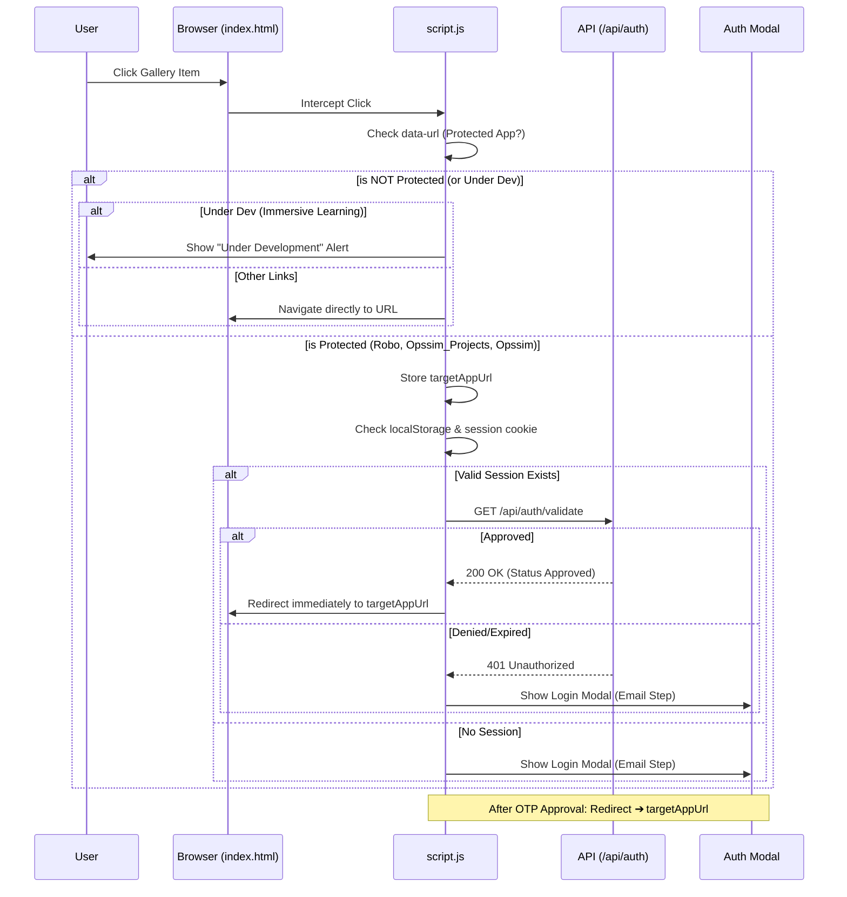

[← Back to Documentation Index](../README.md#detailed-documentation-index)

# 🛠️ Admin FAQ & Troubleshooting Guide

This document provides answers to common administrative questions and step-by-step procedures for managing the Xify platform.

## 🔄 User Authentication & Navigation Flow

The following diagram illustrates how clicks on "Digital Twin Apps" from the homepage are handled by `script.js` to ensure secure access.



---

## 🔍 1. How to search for user sessions by email?

When troubleshooting user login issues, you may need to find their active session ID or check their session expiry.

### 🧪 Development Environment (`dev.xify.in`)

#### Option A: Using the Terminal (Fastest)
Run this command from the server. **Note:** You must start the command with `sqlite3` to ensure it runs as a database query, not a shell command.

```bash
# 1. Navigate to the development folder
cd [REPO_ROOT]

# 2. Query the database directly (Correct syntax)
sqlite3 backend_data/database.db \
"SELECT s.session_id, u.email, s.created_at, s.expires_at \
FROM usersession s \
JOIN user u ON s.user_id = u.id \
WHERE u.email = 'user@example.com' \
ORDER BY s.created_at DESC LIMIT 1;"
```

#### Option B: Using Curl (API)
If the backend is running, you can query the admin API and filter the results:

```bash
# Query the local dev port (8082)
curl -s http://localhost:8082/api/admin-api/admin/sessions | jq '.[] | select(.email == "user@example.com")'
```

#### Option C: Using the Admin Dashboard (UI)
1. Open `https://dev.xify.in/admin_sessions.html`.
2. Use the browser search feature (`Ctrl + F`) to find the email in the live table.
3. The table will show the **Status** (Active/Inactive), **Session ID**, and **Time Remaining**.

---

### 🧪 Staging Environment (`stage.xify.in`)

#### Option A: Using the Terminal
```bash
cd [REPO_ROOT]
sqlite3 backend_data/database.db \
"SELECT s.session_id, u.email, s.created_at, s.expires_at \
FROM usersession s \
JOIN user u ON s.user_id = u.id \
WHERE u.email = 'user@example.com' \
ORDER BY s.created_at DESC LIMIT 1;"
```

#### Option B: Using Curl (API)
```bash
# Query the local stage port (8081)
curl -s http://localhost:8081/api/admin-api/admin/sessions | jq '.[] | select(.email == "user@example.com")'
```

---

### 🚀 Production Environment (`xify.in`)

#### Option A: Using the Terminal
```bash
cd [REPO_ROOT]
sqlite3 backend_data/database.db \
"SELECT s.session_id, u.email, s.created_at, s.expires_at \
FROM usersession s \
JOIN user u ON s.user_id = u.id \
WHERE u.email = 'user@example.com' \
ORDER BY s.created_at DESC LIMIT 1;"
```

#### Option B: Using Curl (API)
```bash
# Query the production port (8080) or domain
curl -s https://xify.in/api/admin-api/admin/sessions | jq '.[] | select(.email == "user@example.com")'
```

---

## 🚦 2. How to check environment health?

If a specific environment is unresponsive, follow these steps:

### 🧪 Development Environment (`dev.xify.in`)

**Check Container Status:**
```bash
cd [REPO_ROOT]
docker-compose ps
```

**View Live Logs:**
```bash
# View combined logs
docker-compose logs -f --tail 50

# View specific backend logs
docker-compose logs -f xify-backend-dev
```

**API Health Check:**
```bash
curl http://localhost:8082/api/admin-api/admin/health
```

---

### 🧪 Staging Environment (`stage.xify.in`)

```bash
cd [REPO_ROOT]
docker-compose ps
curl http://localhost:8081/api/admin-api/admin/health
```

---

### 🚀 Production Environment (`xify.in`)

```bash
cd [REPO_ROOT]
docker-compose ps
curl https://xify.in/api/admin-api/admin/health
```

---

## 📘 3. Common Troubleshooting Tips

### User reports "Invalid OTP"
- **Check Expiry**: Verify the OTP wasn't requested more than 10 minutes ago.
- **Check Delivery**: See [Infrastructure Overview](infrastructure_overview.md#3-mailjet-webhook-monitoring) for instructions on tracking Mailjet delivery events.
- **Database check**: 
  ```bash
  sqlite3 [REPO_ROOT]/backend_data/database.db "SELECT * FROM otp WHERE email='user@example.com' ORDER BY expiry DESC LIMIT 1;"
  ```

### ⚠️ Admin Error: "Main Backend Unreachable"
If the Admin Dashboard stats are empty and the logs show `NameResolutionError` or `Main Backend Unreachable`:

1.  **Check Service Mapping**: Ensure `ENV_NAME` is correctly set in `docker-compose.admin.yml`.
    - Production: `production`
    - Staging: `staging`
    - Development: `development`
2.  **Verify Hostnames**: The Admin API determines the backend hostname based on `ENV_NAME`:
    - `production` -> `xify-backend`
    - `staging` -> `xify-backend-stage`
    - `development` -> `xify-backend-dev`
3.  **Check Internal Networking**:
    ```bash
    # Test if the Admin container can reach the Backend container
    docker exec xify-admin-backend-dev python3 -c "import requests; print(requests.get('http://xify-backend-dev:8000/health').json())"
    ```
4.  **Common Fix**: If the above fails with "Failed to resolve", check `admin_main.py` for hardcoded hostnames and synchronize it with the latest version from Production.

---

## 💬 4. Forum & Community Management

### How to view forum posts of a specific user?
Run this query to see all titles and categories of posts made by a specific email:

```bash
# In Dev/Stage
sqlite3 [REPO_ROOT]/backend_data/database.db \
"SELECT p.id, p.title, p.category, p.status, p.created_at \
FROM forumpost p \
JOIN user u ON p.user_id = u.id \
WHERE u.email = 'user@example.com' \
ORDER BY p.created_at DESC;"
```

---

## 🔒 5. User & Session Control

### How to force a user to logout?
If a user is having session issues or you need to block access immediately, you can invalidate their active session by setting its expiry time to the past.

```bash
# Force logout for a specific user
sqlite3 [REPO_ROOT]/backend_data/database.db \
"UPDATE usersession \
SET expires_at = '2000-01-01 00:00:00' \
WHERE user_id = (SELECT id FROM user WHERE email = 'user@example.com');"
```

> [!TIP]
> After running this, the user will be redirected to the login page the next time they refresh or make an API request.

---

## 💾 6. Database Backups & Verification

To protect against data loss, the Xify platform uses an automated backup and verification system.

### How to trigger a manual backup?
If you're about to perform a major migration or database change, always run a manual backup first:

```bash
cd [REPO_ROOT]
./scripts/backup_db.sh dev
```
*This will create a timestamped, compressed snapshot in the `backups/` directory.*

### How to verify the latest backup?
To ensure the backup system is working correctly and the data matches the live database:

```bash
cd [REPO_ROOT]
./scripts/verify_backups.sh dev
```
*The script will report on freshness (within 24h) and data consistency (matching user count).*

### How to restore from a backup?
In the event of database corruption or data loss:

1. **Stop the services**: `docker-compose stop`
2. **Decompress the backup**: `zcat backups/database.db_YYYY-MM-DD_HHMMSS.sqlite.gz > backend_data/database.db`
3. **Verify permissions**: Ensure the file is owned by the user running Docker.
4. **Restart the services**: `docker-compose up -d`

> [!CAUTION]
> **Restore with care**: Restoring a backup will overwrite the current live database. Always backup the corrupted database before attempting a restore.

For more details, see the full [Database Backup System Documentation](database_backup_system.md).
