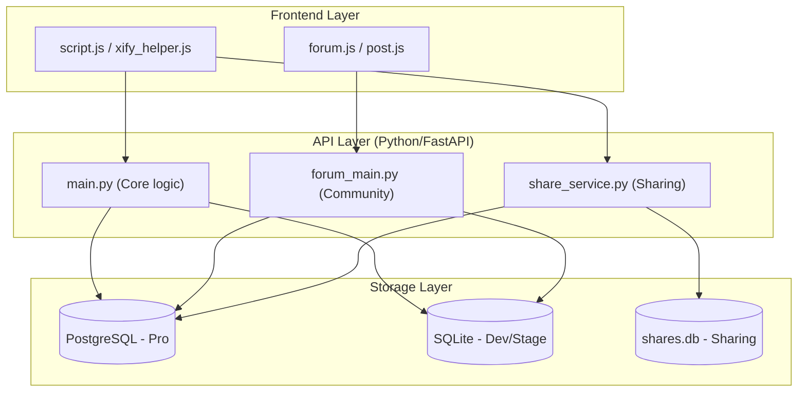

# Exhaustive Xify Database & API Mapping (xify.in)

This document provides a complete and exhaustive mapping of **all** database files, tables, and environments found within the Xify ecosystem.

## 🗄️ Database Environment Overview

The application utilizes multiple database engines depending on the environment. Legacy and Dev/Stage (Non-Pro) environments use SQLite, while the Pro environments use PostgreSQL.

| Environment | Engine | Database Identifier | Status |
| :--- | :--- | :--- | :--- |
| **Dev / Stage** | SQLite | `[REPO_ROOT]/backend_data/database.db` | **Active** |
| **ProDev / ProStage**| PostgreSQL | `opssim_db` (Dockerized) | **Active** |
| **Share Service** | SQLite | `[REPO_ROOT]/backend_data/shares.db` | **Active** |
| **Legacy Backup** | SQLite | `[REPO_ROOT]/backend_data/forum_stage.db` | Stale |

---

## 🛠️ Table Mappings (Unified)

Across both SQLite and PostgreSQL, the table structure remains largely consistent to support the shared backend code.

### 1. Core Application Tables
Shared by `main.py` and `share_service.py`.

| Table | API Service | Method | Purpose |
| :--- | :--- | :--- | :--- |
| `user` | `main.py` | GET/POST | Core user identity records (Email, ID). |
| `usersession` | `main.py` | GET/POST | Active login sessions and expiry tokens. |
| `otp` | `main.py` | POST | One-Time Passwords for authentication. |
| `project` | `main.py` | GET/POST | Container for user projects (includes Grid settings in Pro). |
| `projectdata` | `main.py` | GET/POST | Versioned JSON application state (Verge3D). |
| `emaildeliverylog`| `main.py` | POST | Tracking Mailjet/SMTP delivery status. |
| `share` | `share_service.py`| GET/POST | Mapping UUIDs to public project data. |

### 2. Community Forum Tables
Handled by `forum_main.py` (often mounted into the main app).

| Table | API Service | Method | Purpose |
| :--- | :--- | :--- | :--- |
| `forumpost` | `forum_main.py` | GET/POST | Community issues and bug reports. |
| `forumcomment` | `forum_main.py` | POST | Thread replies and discussion. |
| `forumlike` | `forum_main.py` | POST | "Like" counts and user associations. |
| `forumattachment` | `forum_main.py` | GET/POST | File upload metadata and storage links. |

---

## 🔗 3. Global API URL to Database Mapping

This table provides a direct link between the network endpoints and the underlying data store for all active environments.

| API URL (Endpoint Prefix: `/api`) | Associated Table(s) | Primary Storage | Description |
| :--- | :--- | :--- | :--- |
| `/auth/request-otp` | `otp` | DB | Triggers OTP generation. |
| `/auth/verify-otp-cookie` | `otp`, `user`, `usersession` | DB | Validates OTP and sets session cookie. |
| `/auth/validate` | `usersession`, `user` | DB | Checks session validity. |
| `/projects` | `project`, `user` | DB | Creates/Lists user projects. |
| `/projects/save-data` | `projectdata`, `usersession` | DB | Saves Verge3D application state. |
| `/projects/data/{email}/{name}` | `projectdata`, `usersession` | DB | Retrieves versioned data. |
| `/forum_dev/posts` | `forumpost`, `attachment` | DB | Community feed management. |
| `/share/create` | `usersession`, `share` | `shares.db` / DB | Generates public shareable UUID. |
| `/share/{public_key}` | `share` | `shares.db` / DB | Retrieves shared project data. |

> [!NOTE]
> **"DB"** refers to `database.db` (SQLite) in Dev/Stage and `opssim_db` (PostgreSQL) in Pro environments.

---

## 🛰️ System Architecture & Data Flow



---

## 💻 4. Quick CLI Reference for Data Inspection

### PostgreSQL (Pro)
```bash
docker exec -it xify-db-prodev psql -U opssim_user -d opssim_db
# Inside psql: \dt (list tables), \d <table_name> (describe)
```

### SQLite (Dev/Stage)
```bash
sqlite3 /srv/dev.xify.in/backend_data/database.db
# Inside sqlite: .tables, .schema <table_name>
```
