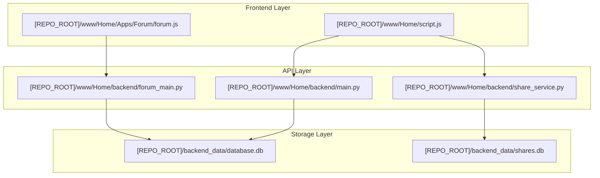

# Exhaustive Xify Database & API Mapping (xify.in)

This document provides a complete and exhaustive mapping of **all** database files and tables found within the `[REPO_ROOT]` directory, as identified by a full system scan.

## 🗄️ Database Environment Overview

The application utilizes multiple SQLite files. Most active services use `database.db` as a unified store, while specific files in `backend_data/` are legacy relics or environment-specific backups.

| Database File | Status | Primary Tables |
| :--- | :--- | :--- |
| `[REPO_ROOT]/backend_data/database.db` | **Primary Production** | `user`, `project`, `projectdata`, `otp`, `usersession`, `emaildeliverylog`, `appusage`, `loginlog`, `share` |
| `[REPO_ROOT]/backend_data/forum_stage.db` | **Stale Legacy Backup** | `forumpost`, `forumcomment`, `forumlike`, `forumattachment`, + Mirrored User/Project tables |
| `[REPO_ROOT]/backend_data/forum_dev.db` | **Stale Legacy Backup** | `forumpost`, `forumcomment`, `forumlike`, `forumattachment`, + Mirrored User/Project tables |
| `[REPO_ROOT]/backend_data/shares.db` | **Share Service (Active)** | `share`, `user` (mirror), `usersession` (mirror) |
| `[REPO_ROOT]/www/Home/backend/shares.db` | **Legacy/Unused** | `share`, `user`, `usersession` (Old location) |
| `[REPO_ROOT]/shares.db` | **Legacy (Empty)** | *None (0 tables)* |
| `[REPO_ROOT]/www/Home/backend/database.db`| **Legacy (Empty)** | *None (0 tables)* |


---

## 🛠️ Exhaustive Table Mappings

### 1. Main Application Database (`database.db`)
Located at: `[REPO_ROOT]/backend_data/database.db`

| Table | API Service (Absolute Path) | Method | JS / UI Component | Purpose |
| :--- | :--- | :--- | :--- | :--- |
| `user` | `[REPO_ROOT]/www/Home/backend/main.py` | GET/POST | `script.js` | Core user identity records (Email, ID). |
| `usersession` | `[REPO_ROOT]/www/Home/backend/main.py` | GET/POST | `script.js` | Active login sessions and expiry tokens. |
| `otp` | `[REPO_ROOT]/www/Home/backend/main.py` | POST | `script.js` | One-Time Passwords for authentication. |
| `project` | `[REPO_ROOT]/www/Home/backend/main.py` | GET/POST | `script.js` | Container for individual user projects. |
| `projectdata` | `[REPO_ROOT]/www/Home/backend/main.py` | GET/POST | `xify_helper.js` | Versioned JSON application state. |
| `emaildeliverylog`| `[REPO_ROOT]/www/Home/backend/main.py` | POST | Admin Dashboard | Tracking Mailjet status (sent/bounced). |
| `loginlog` | N/A (Legacy) | N/A | N/A | **Legacy**: IP/Timestamp logs (Inactive). |
| `appusage` | N/A (Legacy) | N/A | N/A | **Legacy**: Path-level usage tracking (Inactive). |
| `share` | N/A (Legacy) | N/A | N/A | **Legacy**: Mirroring of shares (Inactive). |

### 2. Community Forum (Unified in `database.db` for Stage/Dev)
*Note: Though `forum_main.py` exists as a separate service, it is currently mounted into the main app and shares the `DATABASE_URL`.*

| Table | API Service (Absolute Path) | Method | JS / UI Component | Purpose |
| :--- | :--- | :--- | :--- | :--- |
| `forumpost` | `[REPO_ROOT]/www/Home/backend/forum_main.py` | GET/POST | `forum.js` / `post.js`| Community issues and bug reports. |
| `forumcomment` | `[REPO_ROOT]/www/Home/backend/forum_main.py` | POST | `post.js` | Thread replies and discussion. |
| `forumlike` | `[REPO_ROOT]/www/Home/backend/forum_main.py` | POST | `post.js` | "Like" counts and user associations. |
| `forumattachment` | `[REPO_ROOT]/www/Home/backend/forum_main.py` | GET/POST | `post.js` | File upload metadata and storage links. |

### 3. Sharing Service Database (`shares.db`)
Located at: `[REPO_ROOT]/backend_data/shares.db`

| Table | API Service (Absolute Path) | Method | JS / UI Component | Purpose |
| :--- | :--- | :--- | :--- | :--- |
| `share` | `[REPO_ROOT]/www/Home/backend/share_service.py`| GET/POST | `script.js` -> `post.js`| Mapping UUIDs to public project data. |
| `user` | Mirror | N/A | N/A | Ownership verification. |
| `usersession` | Mirror | N/A | N/A | Session validation during link creation. |

---

## 🔗 4. Global API URL to Database Mapping

This table provides a direct link between the network endpoints (URLs) and the underlying data storage.

| API URL (Endpoint Prefix: `/api`) | Method | Associated Table(s) | Database File | Description |
| :--- | :--- | :--- | :--- | :--- |
| `/auth/request-otp` | POST | `otp` | `database.db` | Triggers OTP generation and email. |
| `/auth/verify-otp-cookie` | POST | `otp`, `user`, `usersession` | `database.db` | Validates OTP and sets session cookie. |
| `/auth/validate` | GET | `usersession`, `user` | `database.db` | Checks if current session is still valid. |
| `/projects` | POST | `project`, `user` | `database.db` | Creates a new user project. |
| `/projects/{user_id}` | GET | `project` | `database.db` | Lists all projects for a specific user. |
| `/projects/save-data` | POST | `projectdata`, `usersession` | `database.db` | Saves versioned state for a Verge3D app. |
| `/projects/data/{email}/{name}` | GET | `projectdata`, `usersession` | `database.db` | Retrieves latest/specific version of data. |
| `/forum_dev/posts` | GET | `forumpost`, `forumcomment` | `database.db`* | Fetches community feed and stats. |
| `/forum_dev/posts` | POST | `forumpost`, `attachment` | `database.db`* | Creates a new community issue/post. |
| `/forum_dev/posts/{id}` | GET | `forumpost`, `comment` | `database.db`* | Fetches full thread detail + comments. |
| `/forum_dev/posts/{id}/like` | POST | `forumlike` | `database.db`* | Toggles user like on a specific post. |
| `/share/create` (Proxied) | POST | `usersession`, `share` | `shares.db` | Generates a shareable UUID for a project. |
| `/share/{public_key}` | GET | `share` | `shares.db` | Publicly retrieves shared project data. |
| `/admin-api/admin/sessions` | GET | `usersession`, `user` | `database.db` | Admin: Monitoring active users. |
| `/admin-api/admin/stats` | GET | `user`, `project` | `database.db` | Admin: System-wide usage statistics. |

*\*Note: In Staging/Dev environments, Forum data shares the `database.db` via unified connection strings.*

---

## 💻 5. API Testing Reference (Terminal/curl Examples)

Use these templates to test the backend services directly from the terminal. 
*Note: Ensure the backend container is running or use the appropriate host port (e.g., `8001` for Stage/Dev).*

### 🔑 Authentication Flow

**1. Request OTP**
```bash
curl -X POST http://localhost:8000/api/auth/request-otp \
     -H "Content-Type: application/json" \
     -d '{"email": "user@example.com"}'
```

**2. Verify OTP & Get Session**
```bash
curl -X POST http://localhost:8000/api/auth/verify-otp-cookie \
     -i \
     -H "Content-Type: application/json" \
     -d '{"email": "user@example.com", "otp": "1234"}'
```
*(Check headers for `Set-Cookie: session_id=...`)*

**3. Check if Session is Active**
```bash
curl -X GET http://localhost:8000/api/auth/validate \
     -H "Accept: application/json" \
     -b "session_id=PASTE_YOUR_SESSION_ID_HERE"
```
*(Returns `{"status": "valid", "user_id": 1, ...}` if session is active)*

---

### 📁 Project Management

**1. Create Project**
```bash
curl -X POST http://localhost:8000/api/projects \
     -H "Content-Type: application/json" \
     -d '{"name": "NewProject", "user_id": 1}'
```

**2. Save Application Data (Requires Cookie)**
```bash
curl -X POST http://localhost:8000/api/projects/save-data \
     -H "Content-Type: application/json" \
     -b "session_id=PASTE_YOUR_SESSION_ID_HERE" \
     -d '{
       "user_email": "user@example.com",
       "project_name": "NewProject",
       "filename": "scene.gltf",
       "data_json": {"key": "value"}
     }'
```

---

### 💬 Community Forum (multipart/form-data)

**1. Create Forum Post**
```bash
curl -X POST http://localhost:8000/api/forum_dev/posts \
     -b "session_id=PASTE_YOUR_SESSION_ID_HERE" \
     -F "title=Issue Title" \
     -F "body=Detailed description here" \
     -F "category=bug"
```

**2. List All Posts**
```bash
curl -X GET "http://localhost:8000/api/forum_dev/posts?category=bug&status=open"
```

---

### 🔗 Sharing Service

**1. Create Share Link**
```bash
curl -X POST http://localhost:8000/api/share/create \
     -H "Content-Type: application/json" \
     -b "session_id=PASTE_YOUR_SESSION_ID_HERE" \
     -d '{"data": {"project_id": 1, "config": "minimal"}}'
```

**2. Retrieve Shared Data**
```bash
curl -X GET http://localhost:8000/api/share/YOUR_PUBLIC_KEY
```

---

## 🛰️ System Architecture & Data Flow



---

> [!WARNING]
> **Stale Artifacts Detected**:
> - `[REPO_ROOT]/backend_data/forum_stage.db` (Modified: Feb 21)
> - `[REPO_ROOT]/backend_data/forum_dev.db` (Modified: Feb 21)
> 
> These files are **NOT used** by the current `uvicorn` processes. Active services (Stage/Dev) have been reconfigured to use their local `database.db` via Docker volumes (`DATABASE_URL=sqlite:////app/data/database.db`). These have been noted for future removal.
