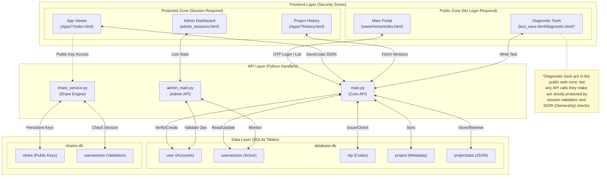
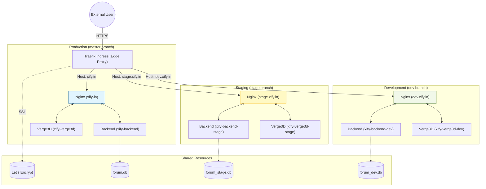
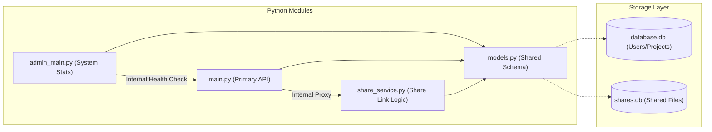
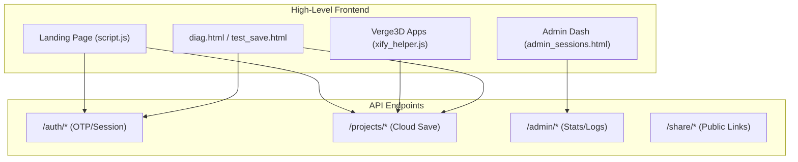
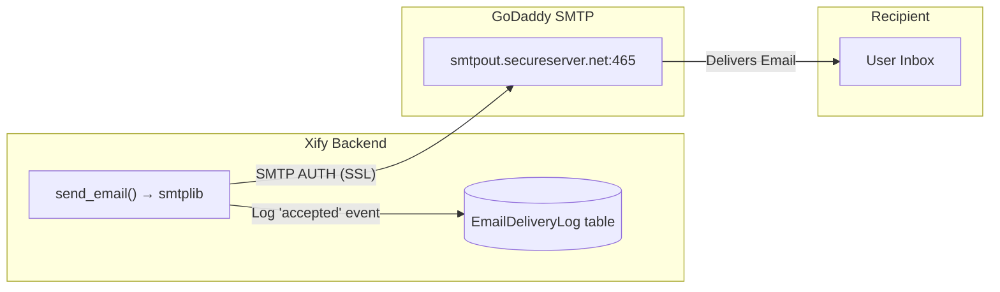

[← Back to Documentation Index](../README.md#detailed-documentation-index)

# Infrastructure Overview

This document explains the service stack powering Xify.in and how the different components interact.

## 🗺️ Master Data Flow Diagram (End-to-End)

This diagram illustrates how specific user-facing files trigger backend Python services, which in turn manage system data.

*(🔍 **[Open this diagram in a separate tab](infrastructure_diagram.html)**)*



---

## Architecture Diagram (Environment Isolation)

Xify.in uses a **Triple-Stack Subdomain Strategy**. Each environment (Production, Staging, Development) runs in its own completely isolated Docker Compose stack with its own networking and storage.



## Network Isolation
Each stack resides in a dedicated Docker network to prevent cross-environment pollution:
*   **Production**: `172.21.0.0/16`
*   **Staging**: `172.24.0.0/16`
*   **Development**: `172.23.0.0/16`

## Core Services

### 1. Traefik (Edge Router)
*   **Role**: Global ingress controller and TLS termination point.
*   **Location**: Managed in `/opt/traefik`.
*   **Features**:
    *   **Automatic SSL**: Uses Let's Encrypt for all subdomains.
    *   **Service Discovery**: Automatically routes `dev.xify.in` and `stage.xify.in` based on labels in the per-environment `docker-compose.yaml` files.

### 2. Isolated Nginx Stacks
*   **Role**: Each subdomain has its own Nginx container serving static files and proxying Verge3D.
*   **Image**: `fholzer/nginx-brotli:latest`.
*   **Features**:
    *   **Environment Specific**: The Nginx in `[REPO_ROOT]` only serves the `dev` branch code.
    *   **Brotli/Gzip**: High-performance compression for 3D assets.
    

## Backend & API Mapping

The backend is composed of four core Python modules and a shared data model.

### 🐍 Backend File Responsibilities



| File | Primary Responsibility | Key Logic |
| :--- | :--- | :--- |
| **[models.py](../www/Home/backend/models.py)** | Data Layer | Defines `SQLModel` entities for Users, Projects, OTPs, and Sessions. |
| **[main.py](../www/Home/backend/main.py)** | Primary API | Handles authentication (OTP), project management, and strict IDOR-protected project data versioning. |
| **[admin_main.py](../www/Home/backend/admin_main.py)** | Admin Portal | Aggregates system stats, monitors active sessions, and streams real-time logs. |
| **[share_service.py](../www/Home/backend/share_service.py)** | Sharing Engine | Manages public share link generation, email delivery, and shared data retrieval. |

---

### 🌐 API Consumption by Frontend



Below is a mapping of how the frontend components interact with these backend services:

| Frontend Component | Consumed API | Backend File | Purpose |
| :--- | :--- | :--- | :--- |
| **[script.js](../www/Home/script.js)** (Landing Page) | `/auth/*`, `/projects/*` | `main.py` | Handles the OTP login flow, session validation, and project list in the modal. |
| **[xify_helper.js](../www/Home/xify_helper.js)** (Apps) | `/projects/save-data` | `main.py` | Injected into Verge3D apps to save progress and version history back to the cloud. |
| **[admin_sessions.html](../www/Home/admin_sessions.html)** | `/admin/*` | `admin_main.py` | Powers the admin dashboard with live session tables, usage stats, and health checks. |
| **Share Viewer** (In-App) | `/share/{key}` | `share_service.py` | Retrieves public project data when someone clicks a shared project link. |
| **[diagnostic.html](../www/Home/Apps/diagnostic.html)** | `/api/auth/validate`, `/api/projects/save-data` | `main.py` | Standalone utility to verify session validity and cloud storage connectivity. |

---

## 🛠️ Environment Configuration (.env)

The behavior of the backend and the Docker orchestration is governed by a **`.env` file** at the repository root. This file contains critical secrets (SMTP passwords) and path configurations.

> [!IMPORTANT]
> For a full list of environment variables, their purpose, and a setup template, see the dedicated **[Environment Configuration Guide (.env)](env_configuration_guide.md)**.

---


## 📧 Email Delivery System (SMTP)

OTP emails are sent via **SMTP** using the **info@xify.in** account hosted on **GoDaddy**.

### Architecture



### Configuration Details
The backend uses the following configuration from `.env`:
*   **SMTP Host:** `smtpout.secureserver.net`
*   **SMTP Port:** `465` (SSL)
*   **SMTP User:** `info@xify.in`
*   **Sender Display Name:** `Xify`

### Email Delivery Logging
When an email is successfully handed off to the SMTP server, the backend logs an `accepted` event in the `EmailDeliveryLog` table. 

> [!NOTE]
> Unlike the previous Mailjet implementation, standard SMTP delivery does not provide real-time webhooks for 'delivered', 'opened', or 'bounce' events. The logs will primarily confirm that the email was successfully sent from the Xify server.

### Querying Delivery Logs
```bash
# Check recent delivery events
sqlite3 ../backend_data/database.db \
  "SELECT * FROM emaildeliverylog ORDER BY timestamp DESC LIMIT 20;"

# Check a specific email
sqlite3 ../backend_data/database.db \
  "SELECT * FROM emaildeliverylog WHERE email='user@example.com' ORDER BY timestamp DESC;"
```

### Debugging & Testing Email Delivery

If OTP emails are not arriving, check the backend logs and verify SMTP connectivity:

1. **Check Backend Logs:**
   Look for "OTP email sent to..." or "Error sending email via SMTP..." in the application logs.
   ```bash
   tail -f /srv/xify.in/backend_data/log_main.txt
   ```

2. **Verify Credentials in .env:**
   Ensure `SMTP_USER` and `SMTP_PASS` are correct.
   ```bash
   grep SMTP /srv/xify.in/.env
   ```

3. **Check SMTP Connectivity:**
   Test if the server can reach the GoDaddy SMTP server on port 465.
   ```bash
   nc -zv smtpout.secureserver.net 465
   ```

> [!WARNING]
> **Spam Folders:** Since emails are sent via a standard SMTP account (`info@xify.in`), they may occasionally be flagged as spam by aggressive filters (e.g., Gmail, Outlook). Encourage users to check their junk folders if the code doesn't arrive.

Get ip address of each ngnix server
```docker inspect -f '{{range .NetworkSettings.Networks}}{{.IPAddress}}{{end}}' dev.xify.in```