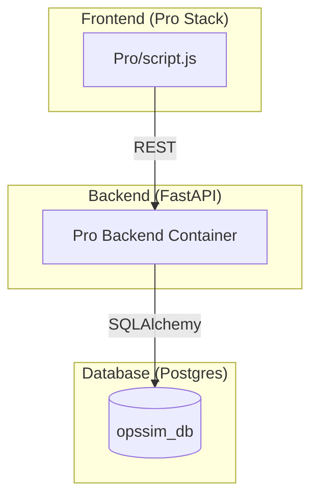

# 🚀 API & Table Mapping (Xify Pro - PostgreSQL)

This document provides the specific mapping for the **Pro** environment (`prodev.xify.in` / `prostage.xify.in`), where the backend has been migrated to use **PostgreSQL**.

## 🗄️ Database Environment (Pro)

The Pro environment utilizes a dockerized PostgreSQL instance.

| Detail | Value |
| :--- | :--- |
| **Engine** | PostgreSQL 15 (Alpine) |
| **Container Name** | `xify-db-prodev` / `xify-db-prostage` |
| **Database Name** | `opssim_db` |
| **Primary User** | `opssim_user` |
| **Connection URL** | `postgresql://opssim_user:opssim_password@db:5432/opssim_db` |

---

## 🛠️ Pro-Specific Table Mappings

In the Pro stack, all core and forum data resides in a single PostgreSQL database (`opssim_db`).

### 1. Unified Application Tables
| Table | API Service | Method | Purpose |
| :--- | :--- | :--- | :--- |
| `user` | `main.py` | GET/POST | Core user records. |
| `usersession` | `main.py` | GET/POST | Active sessions & cookies. |
| `otp` | `main.py` | POST | Authentication tokens. |
| `project` | `main.py` | GET/POST | User projects (includes Pro-only Grid fields). |
| `projectdata` | `main.py` | GET/POST | Versioned JSON application states. |
| `share` | `share_service.py`| GET/POST | Public sharing records. |
| `forumpost` | `forum_main.py` | GET/POST | Community threads. |
| `forumcomment` | `forum_main.py` | POST | Thread discussion. |

---

## 🔗 2. API Endpoint to PostgreSQL Mapping

| API URL (Endpoint) | Associated Table(s) | Notes |
| :--- | :--- | :--- |
| `/api/auth/request-otp` | `otp` | Generates PG record for OTP. |
| `/api/auth/verify-otp-cookie` | `otp`, `user`, `usersession` | Updates `used` flag and creates session. |
| `/api/projects` | `project`, `user` | Saves/Lists from `project` table. |
| `/api/projects/save-data` | `projectdata`, `usersession` | Stores heavy simulation JSON in PostgreSQL. |
| `/api/forum_dev/posts` | `forumpost`, `forumattachment`| Manages community data in `opssim_db`. |
| `/api/share/create` | `share` | Mapping public keys to project IDs. |

---

## 🛰️ Pro Architecture Visualization



---

## 💻 3. Data Inspection Guide

To inspect the production database directly:

```bash
# Enter the DB container
docker exec -it xify-db-prodev psql -U opssim_user -d opssim_db

# Useful psql commands:
# \dt                -> List all tables
# \d project         -> Show columns for 'project'
# SELECT COUNT(*) FROM user; -> Count total users
```

> [!IMPORTANT]
> The Pro environment is completely isolated from the SQLite files used in Dev/Stage. Any changes made here affect the PostgreSQL instance only.
